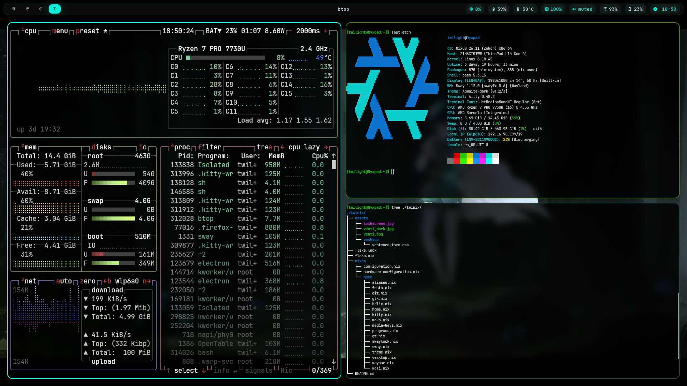

# Twinix

Yet another stoobid nix config



# Features
- NixOS + Home Manager config managed with flakes
- SwayFX based TWM
- Waybar, Wofi & Mako for the usual desktop shenanigans
- Custom GTK, Qt and terminal(kitty :3) theming
- Helix configured as primary editor
- ~~Vesktop themed() to match the rest of the desktop~~(do not use this I am WARNING you)
- Custom alises and media-key bindings
- Modular Home Manager config so individual programs can be configured independently

## Keybinds

Cause everybody loves a keyboard-centric workflow :v

`Mod` = Super / Windows key

### Windows

| Key                     | Action                         |
| ----------------------- | ------------------------------ |
| `Mod + h/j/k/l`         | Focus left/down/up/right       |
| `Mod + Shift + h/j/k/l` | Move window left/down/up/right |
| `Mod + Shift + Space`   | Toggle floating                |
| `Mod + q`               | Kill focused window            |
| `Mod + r`               | Enter resize mode              |

### Workspaces

| Key                 | Action                       |
| ------------------- | ---------------------------- |
| `Mod + 1–9`         | Switch to workspace 1–9      |
| `Mod + Shift + 1–9` | Move window to workspace 1–9 |

### Applications

| Key               | Action                 |
| ----------------- | ---------------------- |
| `Mod + Enter`     | Open Kitty             |
| `Mod + Space`     | Open Wofi(in drun)     |
| `Mod + b`         | Open Firefox           |
| `Mod + e`         | Open Nautilus          |
| `Mod + Shift + q` | Lock screen            |
| `Mod + Shift + e` | Exit Sway              |

### Screenshots

| Key               | Action                                          |
| ----------------- | ----------------------------------------------- |
| `Print`           | Screenshot entire screen                        |
| `Mod + Shift + s` | Select area and copy screenshot                 |
| `Mod + Shift + c` | Scan QR code from selected area and copy result |

### Media & Brightness

| Key                     | Action              |
| ----------------------- | ------------------- |
| `XF86AudioMute`         | Toggle mute         |
| `XF86AudioLowerVolume`  | Decrease volume     |
| `XF86AudioRaiseVolume`  | Increase volume     |
| `XF86MonBrightnessDown` | Decrease brightness |
| `XF86MonBrightnessUp`   | Increase brightness |

### Resize mode

`Mod + r` enters resize mode.

| Key           | Action             |
| ------------- | ------------------ |
| `h/l`         | Shrink/grow width  |
| `k/j`         | Shrink/grow height |
| `Mod + Enter` | Exit resize mode   |

# Setup Instructions
just do a simple

```sh
git clone https://github.com/0x0c12/twinix ~/twinix
```

~~it doesn't HAVE to be ur home directory tbh~~

UPDATE: NOW, it does hahahaha(i hate myself)

also I haven't included hardware configuration because:
- i genuinely cannot guess ur hardware and partition configs and ur partition UUIDs(so don't blame me for a broken system)

anyway, to generate hardware do this

```sh
nixos-generate-config --show-hardware-config > ~/twinix/nixos/hardware-configuration.nix
```

you may have to bootstrap home-manager as well


```sh
nix run github:nix-community/home-manager -- switch --flake .#twilight
```

-# Note that you only need to run this ONCE, then you can just use home-manager
-# simply as given below

```sh
home-manager switch --flake .#twilight
```

# Actually configuring it yourself

If you wanted to add some packages to home manager, just add a program in the
program.nix

If you want to add something configurable, create a new nix file, import it into home.nix and then configure it yourself.

I didn't really modularise the system configuration(which I tbh should), but I am WAY too lazy for that

ONE VERY IMPORTANT THING BTW, since I have decoupled the configurations for
config.nix and home-manager, you kinda have to run them separately if you modify any
now according to me this is nice, because my home user doesn't need to update system
packages everytime I change one line in the config file. Likewise, I don't have it update my user data everytime I change something in config.

You do something like this

```sh
sudo nixos-rebuild switch --flake .#twinix
```

for system-wide

and

```sh
home-manager switch --flake .#twilight
```

for user-specific

# File structure

```
.
├── assets
│   ├── lockscreen.jpg
│   ├── venti_dark.jpg
│   ├── venti.jpg
│   └── vesktop
│       └── ventcord.them.css
├── flake.lock
├── flake.nix
├── nixos
│   ├── configuration.nix
│   ├── hardware-configuration.nix
│   └── home
│       ├── aliases.nix
│       ├── fonts.nix
│       ├── git.nix
│       ├── gtk.nix
│       ├── helix.nix
│       ├── home.nix
│       ├── kitty.nix
│       ├── mako.nix
│       ├── media-keys.nix
│       ├── programs.nix
│       ├── qt.nix
│       ├── swaylock.nix
│       ├── sway.nix
│       ├── theme.nix
│       ├── vesktop.nix
│       ├── waybar.nix
│       └── wofi.nix
└── README.md
```

I just added this to flex the tree command which I found cool :3
